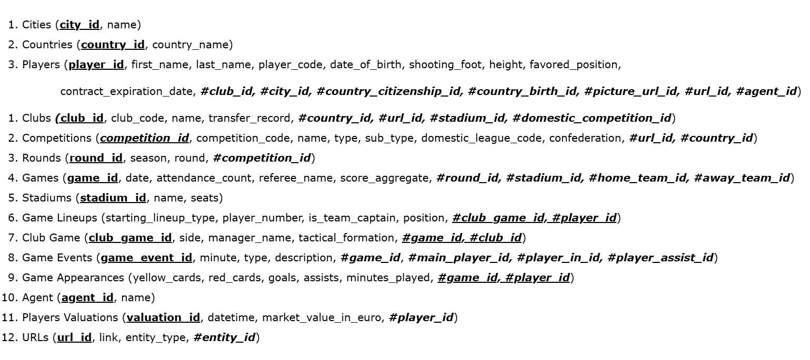

# Project JPA: Football Clubs Data Importer

## Overview

This application reads european football clubs historical data from CSV files and persists it into a relational database
using Java, JPA, and Hibernate.  
It is designed for efficient and controlled data import and demonstrates best practices in database modeling, JPA entity
mapping, and data processing.

---

## Features

- **Controlled Import:** Control for each entry to avoid duplicates, with caching functionality.
- **JPA/Hibernate:** Uses modern Java persistence best practices.
- **Normalized Data Model:** Follows a well-structured, normalized schema.
- **Extensible:** Easily adaptable for additional data sources or schema changes.
- **Clear Separation:** DTOs, entities, and mappers are cleanly separated.

---

## Data Model

The application is based on a normalized data model suite for sports with players, clubs, competitions, and more.

### Conceptual Model (MCD)


### Logical Model (MLD)




---

## Technologies Used

- **Java 21**
- **JPA (Hibernate)**
- **OpenCSV**
- **MariaDB**
- **Maven**
- **LogBack (for log generation)**
- **Jupiter (unit testing)**
- **Mockito**

---

## Usage

- The application will read the CSV files, map them to DTOs, convert them to entities, and finally persist them in the
  database.
- Progress and errors will be logged to log files.

---

## Project Structure

```

`-- fr
    `-- diginamic
        `-- geoff
            |-- builder         # Classes for building complex objects (e.g., DTO builders, entity builders)
            |-- dao             # Data Access Objects: classes for database CRUD operations
            |-- dto             # Data Transfer Objects: plain objects for transferring data between layers
            |-- entity
            |   |-- compositeid # Classes for composite primary key definitions (e.g., @Embeddable IDs)
            |   `-- lookup      # Lookup/reference entities (e.g., enums, static tables, code lists)
            |-- exception       # Custom exception classes for error handling
            |-- mapper          # Classes for mapping between entities and DTOs (e.g., Entity <-> DTO)
            |-- parser          # Classes for parsing input files (CSV, JSON, etc.)
            |-- service
            |   `-- entity      # Service classes for business logic, often per-entity (e.g., PlayerService)
            `-- utils           # Utility/helper classes (e.g., InputHelper, common functions)
```